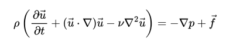
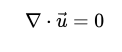
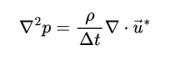
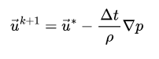
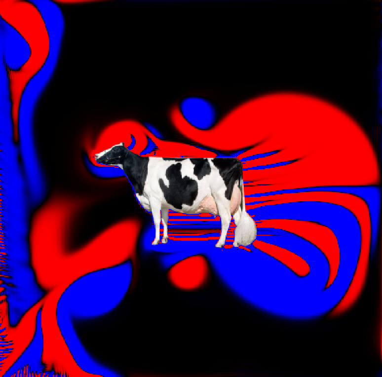

# Simulador de dinámica de fluidos numérico

Resuelve las ecuaciones de Navier-Stokes para un fluido incompresible.  
Implementación en C y paralelización en GPU usando CUDA.

## Descripción

Las ecuaciones de Navier-Stokes para un fluido incompresible tienen la forma:

<p align="center">
  
</p>

La condición de incompresibilidad se denota imponiendo que la divergencia del campo de velocidades sea 0:

<p align="center">
  
</p>

El programa utiliza cálculo distribuido en GPU mediante CUDA, aprovechando las bondades de la memoria compartida (*shared memory*) de los bloques para acelerar la velocidad de solución de las ecuaciones diferenciales.

### Método usado para obtener las soluciones

* **Paso 1:** Resolvemos la ecuación de Navier-Stokes por diferencias finitas ignorando la presión. A esta solución la llamaremos $u^*$ para el campo de velocidades en $x$ e $y$.
* **Paso 2:** Calculamos la corrección en la ecuación restando el gradiente de la presión para obtener $u$.
* **Paso 3:** Al aplicar la corrección a la condición de incompresibilidad a $u$ y sustituir la propuesta, obtenemos la siguiente ecuación de Poisson:

<p align="center">
  
</p>

Al resolver la ecuación de Poisson y calcular la corrección en la forma:

<p align="center">
  
</p>

obtenemos una solución para el paso $k+1$ de $u$.

## Demo

<p align="center">
  
</p>

## Requisitos del Sistema y Dependencias

### Hardware
* GPU NVIDIA con soporte para CUDA (Compute Capability 3.0+).

### Software y Librerías
* **NVIDIA CUDA Toolkit** (nvcc, cuda_runtime).
* **Compilador C/C++** (GCC/G++ en Linux o MSVC en Windows).
* **GLFW 3:** Para la gestión de ventanas y contextos de OpenGL.
* **GLAD:** Cargador de extensiones de OpenGL (incluido en el proyecto).
* **stb_image:** Librería header-only para carga de imágenes (incluida).

## Compilación y Ejecución

El proyecto utiliza **CMake** para la configuración y gestión del build, junto con **CUDA-OpenGL Interoperability** para mapear los buffers de simulación directamente al contexto de renderizado de la GPU.

### Requisitos previos

* **CMake** (v3.18 o superior)
* **NVIDIA CUDA Toolkit**
* **GLFW 3** y **OpenGL**

En Arch Linux / Manjaro:
```bash
sudo pacman -S cmake cuda glfw-x11
```
### Compilación
Se necesita crear la carpeta de compilación y generar los archivos con CMake

```bash
mkdir build && cd build
cmake ..
```
Compilamos usando todos lo nucleos disponibles

```bash
make -j$(nproc)
```

### Ejecución
Una vez habiendo compilado solo hacemos
```bash
make run
```
## Adición de Obstáculos y Condiciones Iniciales

El simulador permite introducir geometría de obstáculos arbitrarios y personalizar las condiciones iniciales para analizar la dinámica del flujo en distintos escenarios.

### Definición de Obstáculos mediante Imágenes PNG (Canal Alfa)

Añadir objetos a la simulación es sencillo: basta con incluir una imagen PNG cuyas dimensiones coincidan exactamente con la resolución de la malla (de lo contrario, el simulador omitirá la carga). 

El procesamiento se realiza de la siguiente manera:
1. Las componentes de color e intensidad de la imagen se normalizan automáticamente en el rango $[0, 1]$.
2. Se evalúa el **canal alfa** de cada píxel: si $\text{alpha} > 0.5$, la celda correspondiente se clasifica como un obstáculo sólido.
3. En los puntos identificados como obstáculo, la GPU aplica la condición de frontera de no deslizamiento, anulando automáticamente los campos de velocidad ($\mathbf{u} = 0$) y ajustando el comportamiento de la presión.

### Condiciones Iniciales

Las condiciones iniciales del campo de flujo (distribución inicial de velocidades y presión) se configuran en el archivo `ci_functions.cuh`. El archivo incluye una función predefinida y algunas sugerencias para probar.